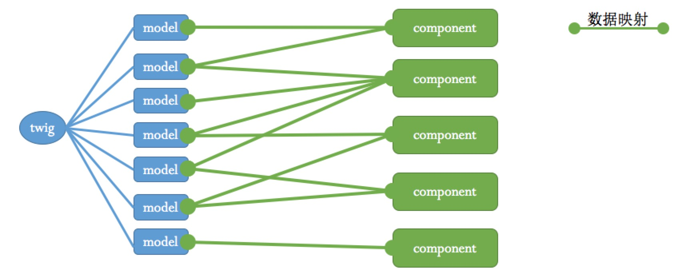
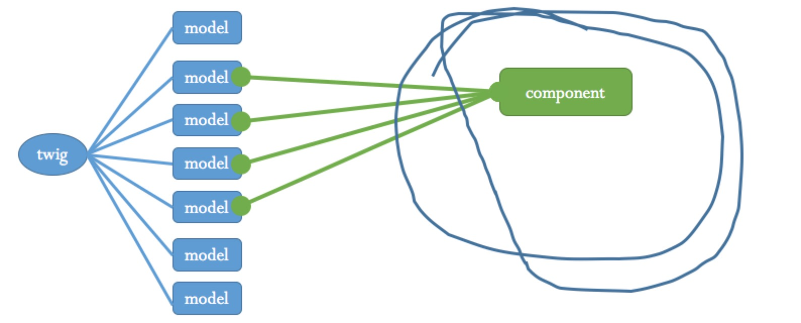
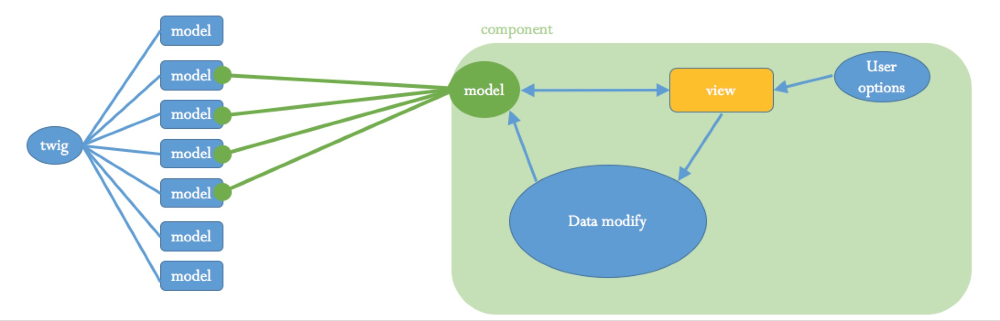

# vue-twig
用于vue.js的数据mvc的model层插件,区别于单项数据流的另一种体验,
属于mvc思想的优化,个人这么理解
同时提供localStorage,sessionStorage本地存储功能

## demo
todomvc:https://weivea.github.io/vue-twig/

## install

```
npm install vue-twig --save
```

## usage


```

//初始化
import Vue from 'vue'
import twig from 'vue-twig'
import co from 'co'  //运行Generator函数需要
import app from './app'

var model = {
              key: "model名",
              saveType: twig.saveType.localStorage,//存储类型.localStorage/sessionStorage
              dataFun: function (data) {//可以是普通函数,Generator函数(需要co模块),async函数
                //data:缓存的数据

                //生成初始化数据

                return data;//返回初始化的数据
              }
            }

Vue.use(twig, model, [co])//co为可选参数
//或
Vue.use(twig, [model1,model2,moel3 ...],[co])

//数据初始化成功后创建应用实例
twig.ready(function () {
  window._App = new Vue({
      el: '#container',
      components: {
        app
      },
      render (h) {
        return (
          <app/>
        )
      }
    })
})


//组件接入子model
//app.js

export default {
  name: 'app',
  data: function () {
    //接入twig,可选择性接入
    var twigs= this.$twigWarp({
      session: this.$twig.session,
      storage: this.$twig.storage,
      dataTree: this.$twig.dataTree
    })

    //私有data
    var privates={
        a:1,
        b:2
    }
    return Object.assign(twigs,privates)
  },

  //只读型接入介，
  computed: {
      formA: function () {
          return this.$twig.session.form.a
      }
  },
  ...
}

```

### warning

1:twig的接入具有非常大的灵活性,随意操作也会带来问题,像redux也是有『数据操作强约束』的,不能改变
store的数据结构,twig同样如此;

2:data中接入的twig数据要求是对象(索引类型),接入值类型不能触发深入式响应,当然计算属性可以接入值类型;

3:被接入的twig根节点强制不允许被赋值操作;

## 描述

twig并不是一个"开发便利性","性能"都超越vuex或其它流程插件的这样一个定位东西.
twig是在mvc的开发思想上,做了进一步模块功能的开发细分:以此大到优化开发流程的目的.
提供一种异于『绝对的单项数据流』的新的开发思维卡供选择

大致思想如下:
+ 应用总的数据由twig管理,根据功能分成不同的model;
+ web应用根据功能和视图划分为不同的组件(component),接入对应的model,形成映射关系. 在单个组件中,只关心组建内model的数据;
+ 组件的view由model数据驱动,对组件内model的操作,就是对twig中model的操作;
+ 单个组建内部,使用什么样的数据操作流程都没有关系;

*数据接入*

*接入简化*

*深入分解*


固有的mvc因为在复杂页业务场景不好管理model与view之间的关系,twig将程序整体划分为一个一个小的相对独立的子mvc,这样一定程度的解决了
原有mvc模式的复杂性,有保留了model与view的直接联系.

这里借鉴了angular.js的rootScope的思想.只是我们每个组件(component/controller)只接触和自己相关的数据;

基于vue深入式相应的特性,组件对model的修改,可触发所有接入该model的组件view的更新;

程序的设计应以model数据结构为准则, 组件(component)不得修改model的数据结构（flex,redux 亦然）,

